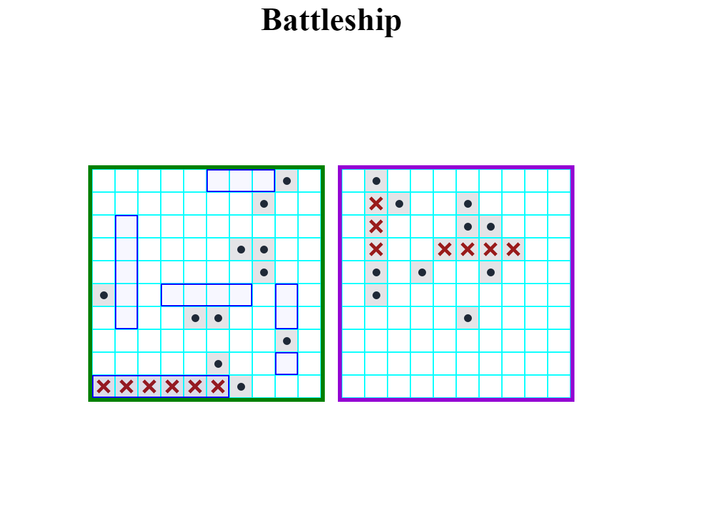

#Battleship Game

Can you hit all enemy battleships before he gets yours? 

**Link to project:** https://bojan227.github.io/battleship_game/

## How It's Made: 
**Tech used:** HTML, CSS, JavaScript

## Lessons Learned:
I learned a lot about Test Driven Development, it helped me to write my factory functions with lesser bugs and makes things a lot easier.
Another thing is that my test driven development should always go as red, green, refactor  in order to write cleaner and reusable code.
